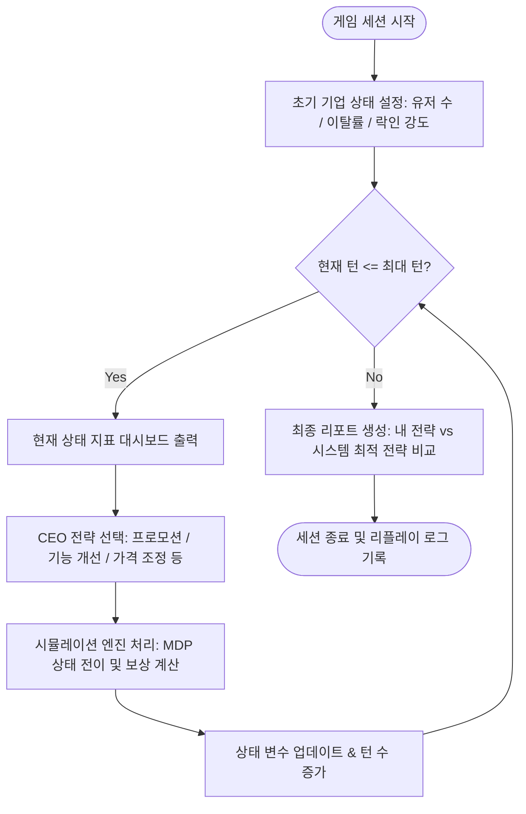

# 📊 Retention Strategy Simulator: 꼬우면 니가 CEO 하던가

> **사용자 리텐션(Retention) 문제를 단순 예측을 넘어 상태와 정책 기반의 순차적 의사결정(MDP)으로 해결하는 턴제 비즈니스 시뮬레이션 웹 서비스**

---

## 💡 About Repository & Description

*   **Repository Name Recommendation**: `Retention-Strategy-Simulator`
*   **Repository Description (About) Recommendation**:
    *   **영문**: A turn-based simulation web service for managers to experience retention strategy decisions based on MDP and user lock-in effects.
    *   **한글**: MDP와 사용자 락인 효과를 기반으로, 사용자가 서비스 기업의 의사결정권자가 되어 매 턴 리텐션 전략을 선택하고 지표 변화를 경험하는 턴제 시뮬레이션 웹 서비스.

---

## 🔑 Key Capabilities (이 프로젝트를 통해 증명하는 역량)

이 프로젝트는 비즈니스 도메인의 의사결정 프로세스를 수학적/논리적 모델로 해석하고, 이를 동작하는 웹 서비스로 구현할 수 있는 풀스택 역량을 포트폴리오로 증명합니다.

### 1. 백엔드 및 비즈니스 아키텍처 설계
*   **Python Flask 기반 RESTful API 설계**: Flask를 활용하여 클라이언트와 핵심 시뮬레이션 엔진 간의 빠르고 유연한 REST API 통신 환경을 구축했습니다.
*   **의존성 및 빌드 최적화 (uv)**: 차세대 초고속 Python 패키지 매니저인 `uv`를 활용하여 모노레포 내 다중 워크스페이스(`be`, `back_research`)의 의존성 충돌을 차단하고 격리된 가상 환경을 효율적으로 구축했습니다.
*   **환경 변수 관리 (python-dotenv)**: 보안 강화를 위해 서비스 자격 증명 및 설정을 환경 변수로 관리하며, 개발(Local) 환경과 배포(Production) 환경 설정을 엄격히 분리 운용했습니다.
*   **의사결정 알고리즘 모델링**: 단순한 조건문 분기가 아닌 마르코프 의사결정 프로세스(MDP)를 백엔드 시뮬레이션 엔진 코어로 구현하여 비즈니스 로직의 깊이를 높였습니다.

### 2. 프론트엔드 및 데이터 시각화
*   **JavaScript & HTML/CSS 인터랙티브 UI**: 턴제 시뮬레이션에 필요한 지표 변화를 실시간 대시보드 구조로 렌더링하고, 복잡한 데이터 시각화를 반응형으로 제공합니다.
*   **상태 전이 흐름 제어**: 비동기 API 통신과 턴 인터랙션 사이의 사용자 흐름(Session Entry ➡️ Turn Play ➡️ Summary Report)을 매끄러운 사용자 경험으로 풀어냈습니다.

---

## 🛠️ Technology Stack (기술 스택)

| 분류 | 사용 기술 및 도구 | 상세 역할 |
| :---: | :--- | :--- |
| **Backend** | `Python Flask`, `uvicorn` | 경량 REST API 서버 구축 및 실시간 엔진 서빙 |
| **Env & Tooling** | `uv`, `python-dotenv` | 가상환경 및 의존성 초고속 동기화, 환경 변수 보안 관리 |
| **Frontend** | `JavaScript`, `HTML5 / CSS3` | 반응형 시뮬레이션 대시보드 화면 및 차트 시각화 UI 개발 |
| **Data & Model** | `Pandas`, `Scikit-learn`, `XGBoost` | 유저 이탈 예측 데이터 분석, 시뮬레이션 시나리오 보정 및 검증 |
| **Collaboration** | `Git / GitLab`, `Markdown` | GitHub Flow 정책에 기반한 이슈 추적 및 모노레포 버전 관리 |

---

## 🚀 Key Features (주요 기능)

### 1. 🎮 턴제 의사결정 시뮬레이션 (Turn-based Decision Simulation)
*   사용자는 최고 경영자(CEO)가 되어 **매 턴 리텐션 전략(Action)**을 선택합니다.
*   선택에 따라 사용자 수, 이탈률(Churn Rate), 충성도, 락인 효과 등의 **상태 변수(State)**가 동적으로 변화합니다.

### 2. 📈 락인 강도(Lock-in Intensity) 기반 시나리오 비교
*   **강한 락인(High Lock-in)** 기업과 **약한 락인(Low Lock-in)** 기업 2가지 비즈니스 환경을 제공합니다.
*   동일한 전략적 선택이 기업의 본질적 체질에 따라 장기적으로 어떻게 완전히 다른 결과를 초래하는지 시뮬레이션합니다.

### 3. 📊 실시간 대시보드 및 결과 리포트
*   사용자 수 전이 및 누적 매출 등 핵심 KPI를 그래프와 카드로 시각화하여 전달합니다.
*   게임 종료 시 사용자의 전략 결과(My Policy)와 시스템이 추천하는 최적 전략(Baseline Policy)의 지표를 상호 비교 분석하는 종합 리포트를 제공합니다.

---

## 📊 Core Architecture (핵심 시뮬레이션 흐름)

시뮬레이션 엔진은 플레이어가 의사결정을 내릴 때마다 상태가 바뀌고 보상을 얻는 MDP(Markov Decision Process)의 논리적 흐름에 따라 구동됩니다.



---

## 📂 Directory Structure (프로젝트 구조)

모노레포 구조를 채택하여, 백엔드 엔진과 프론트엔드 UI를 명확히 격리하면서도 기획 문서 및 분석 실험 환경을 원활하게 연계하도록 설계했습니다.

```text
.
├── fe/                  # 프론트엔드 (JavaScript & HTML/CSS 기반 대시보드 웹 애플리케이션)
│   ├── src/             # 화면 구성 요소 및 API 연동 소스 코드
│   └── package.json     # 패키지 의존성 정의 파일
│
├── be/                  # 백엔드 Flask API 서버 및 메인 시뮬레이션 엔진
│   ├── src/             # API 라우트 및 MDP 시뮬레이션 코어 로직
│   ├── tests/           # 엔진 유닛 테스트 및 API 검증 코드
│   ├── pyproject.toml   # uv 기반 파이썬 프로젝트 정의
│   └── uv.lock          # 고정된 백엔드 종속성 락 파일
│
├── back_research/       # 데이터 사이언스 연구 및 머신러닝 실험 환경
│   ├── datasets/        # 유저 이탈 분석 및 시뮬레이션 보정용 합성 데이터셋
│   ├── pyproject.toml   # 리서치 가상환경 설정 파일
│   └── README.md        # 리서치 실험 파이프라인 매뉴얼
│
├── docs/                # 프로젝트 기획 및 아키텍처 설계 문서
│   ├── prds/            # 서비스 요구사항 명세서 (PRD)
│   └── project_specific/# 시스템 아키텍처 및 상세 가이드라인
│
└── .gitignore           # 로컬 개발 설정 및 가상환경(.venv) 제외 파일 설정
```

---

## ⚙️ Getting Started (로컬 실행 방법)

### 1. Backend 구동
백엔드는 `uv`를 사용하여 가상환경을 구축하고 Flask API를 서빙합니다.

```bash
# 백엔드 디렉터리 이동
cd be

# 의존성 패키지 동기화 (.venv 자동 생성)
uv sync

# API 백엔드 서버 기동
uv run uvicorn src.main:app --reload --port 8000
```

### 2. Frontend 구동
프론트엔드 정적 파일들을 로컬 개발 서버를 통해 브라우저에서 실행합니다.

```bash
# 프론트엔드 디렉터리 이동
cd fe

# 패키지 빌드 및 개발 서버 기동
npm install
npm run dev
```
